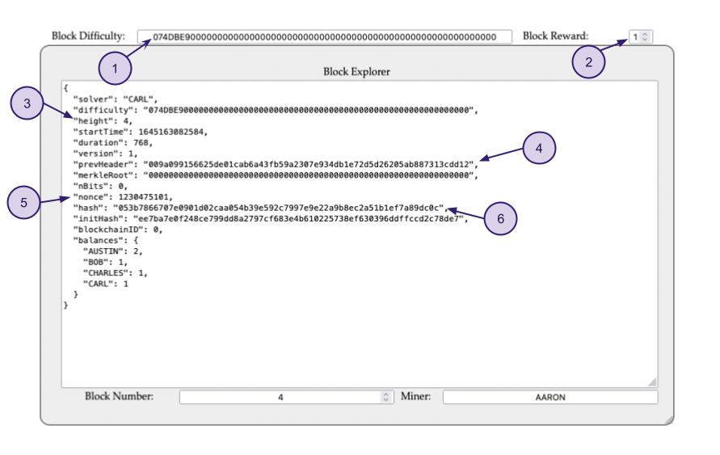
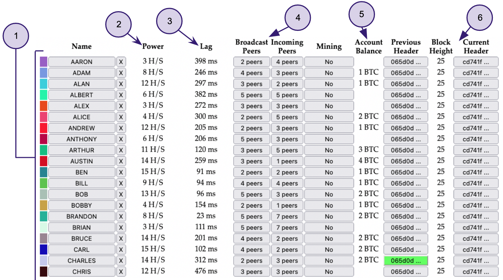
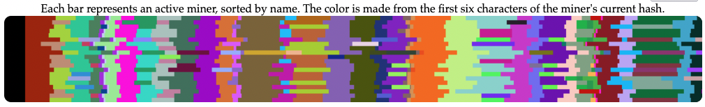

# Proof of Work Network Simulator by simewu

[Github repository](https://github.com/simewu/blockchain-simulator)  

## v0.12

### Block visualizer

  

1. **Block difficulty:** A measure of how difficult it is to find a hash below a given target. 
The Bitcoin network has a global block difficulty. Valid blocks must have a hash below this target*.
2. **Block reward:** When a block is discovered, the discoverer may award themselves 
a certain number of bitcoins, which is agreed-upon by everyone in the network. 
Currently this bounty is 6.25 bitcoins; this value will halve every 210,000 blocks.
3. **Height:** Number of blocks preceding it in the blockchain.
4. **Previous header:** Previous block hash.
5. **Nonce:** It is a field whose value is adjusted by miners so that 
the hash of the block will be less than or equal to the current target of the network.
6. **Hash:** The value to be find by the miner.
Each hash basically gives you a random number between 0 
and the maximum value of a 256-bit number (which is huge). If your hash is below 
the target, then you win. If not, you increment the nonce (completely changing the 
hash) and try again.

>\* The target is a 256-bit number (extremely large) that all Bitcoin clients share. 
>The SHA-256 hash of a block's header must be lower than or equal to the current target for 
>the block to be accepted by the network. The lower the target, the more difficult it is to 
>generate a block. _See [Bitcoin target calculator](https://dlt-repo.net/bitcoin-target-calculator/)_

### Miners

  

1. **Nodes:** Peers participating in network, each one with different stats and the capacity
of mining new blocks.
2. **Hashrate:** Measures the miner's performance. It determines how fast it can solve 
the cryptographic puzzles. 
3. **Lag:** Simulated latency for each node, this value affects how quickly the
network synchronizes.
4. **Broadcast and incoming peers:** Each node has the capability of broadcasting and receiving
blocks amongst its peers, this allows network synchronicity as new blocks get spreaded.
5. **Account balance:** This field shows the bitcoin rewards miners acquire after succesfully mining 
blocks. It also may show temporary balances as forks take place in the network, every reward 
corresponding to stale blocks dissapears after the node updates and re sychronizes the network.
6. **Block height and current header:** Both of these values show how nodes agree and update to the
last block mined.

> The hashrate of the network is calculated based on the time between blocks. This
>measurement over long periods can be considered indicative and similar calculations
>are used in Bitcoin's difficulty adjustment.

### Network Visualizer

 

This graph shows how miners broadcast blocks and how the whole network implements them over time.
Forks can be identified where one or multiple bars vary in color from the majority of nodes. Eventually
this forks become invalid as these nodes catch up with the rest.

## v1.0

Coming soon